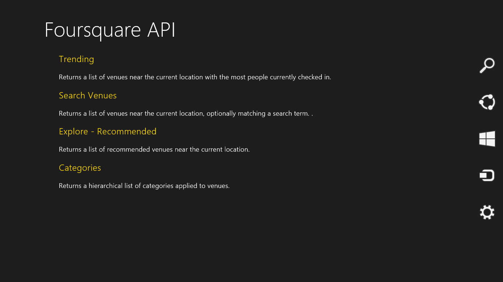
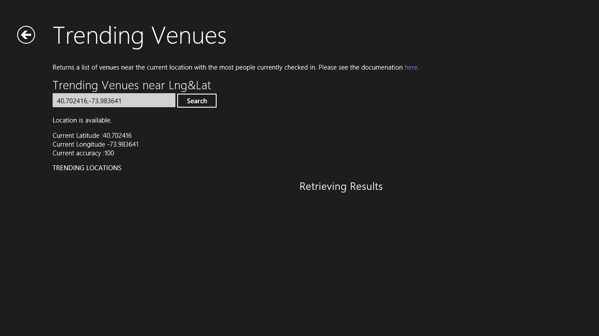

#APIMASH Foursquare Starter Kit
##Date: 6.19.2013
##Version: v1.0.0
##Author(s): Stacey Mulcahy
##URL: http://github.com/apimash/starterkits

----------
###Description
The Foursquare Starter Kit uses the Foursquare api and illustrates how to use many of the endpoints that do not require authorization. All calls do require a client id however.
 
 

###Features
 - Invokes the Foursquare API (https://developer.foursquare.com)
 - Enables various endpoints without oAuth - all venue calls ( search, get popular, categories ) 
 - Demonstrates how to use the winjs list component
 - Demonstrates how to determine the device's geolocation
 - Provides a baseline for a Windows 8 Store App
 - For API documentation, please see https://developer.foursquare.com

###Requirements

 - Windows 8
 - Visual Studio 2012 Express for Windows 8 or higher
 - Foursquare application key ( client id ) https://developer.foursquare.com
 - Utilizes jQuery version 2.0.0 (http://code.jquery.com/jquery-2.0.0.js)

###Setup

 - Register with Foursquare and register a new application ( https://developer.foursquare.com)
 - Keep track of the client id and secret once you have registered.
 - Download the Starter Kit Zip Portfolio from http://apimash.github.io/StarterKits/
 - Open the Solution in Visual Studio
 - Replace the [CLIENT_ID] and [CLIENT_SECRET] variable in the js/apiglobals.js with your own client id key
 - Compile and Run
 **NOTE**: You will need to add your own developer signing certificate to the project, by opening the package.appxmanifest file, and switching to the Packaging tab. On the packaging tab, click the "Choose Certificate..." button, and in the resulting dialog, click the "Configure Certificate..." drop-down, and select "Create test certificate..." then click OK to dismiss all dialogs, and save the app manifest file.

###Customization
This example exposes all the endpoints at their most basic level.Some endpoints have options or parameters to help tailor the result set, please refer to the documentation from Foursquare. The example provided use the defaults.  Venue information has geolocation information, so mash ups with maps, or other apis leveraging geolocation would work nicely.

App Ideas:
- Meetup Rater: Identify which venues from meetup have the most checkins or are most popular. Or trending meetups. 
- What is hot near you: Mash up with maps to find things near you that are popular
- Dog Shelter finder: Search under categories for dog shelters 

###Future Features

----------

##Change Log
###v1.0.1
- Modified readme

##DISCLAIMER: 
 
The sample code described herein is provided on an "as is" basis, without warranty of any kind, to the fullest extent permitted by law. Both Microsoft and I do not warrant or guarantee the individual success developers may have in implementing the sample code on their development platforms or in using their own Web server configurations. 
 
Microsoft and I do not warrant, guarantee or make any representations regarding the use, results of use, accuracy, timeliness or completeness of any data or information relating to the sample code. Microsoft and I disclaim all warranties, express or implied, and in particular, disclaims all warranties of merchantability, fitness for a particular purpose, and warranties related to the code, or any service or software related thereto. 
 
Microsoft and I shall not be liable for any direct, indirect or consequential damages or costs of any type arising out of any action taken by you or others related to the sample code.

